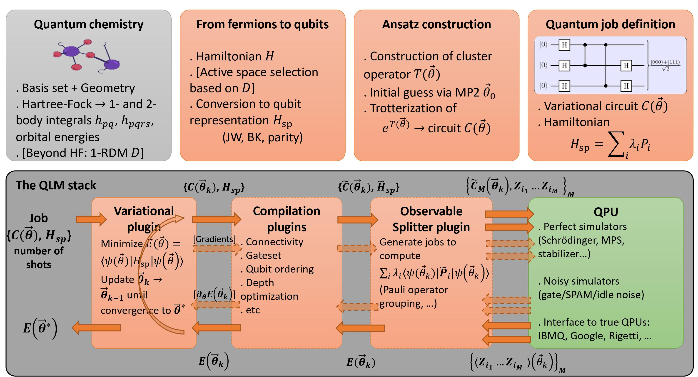

👋 Welcome to the documenentation of OpenVQE package based on the tools for quantum chemistry on the ATOS Quantum Learning Machine

<!--more-->

OpenVQE facilitates the development of new algorithms on quantum computers. It consists of a couple of new modules
that extend the main myQLM/myQLM-fermion implementations. 

The QLM workflow for quantum chemistry. Top row: Steps to prepare a variational quantum job containing a
parameterized circuit and the Hamiltonian whose ground state energy one wants to approximate. The leftmost (grey) box uses
standard third-party quantum chemistry modules. Orange boxes stand for QLM libraries. Bottom row: QLM stack, with plugins
(orange boxes) that pre- and post-process the job and results, and a QPU (green box) that executes the quantum job and returns
a result.

## Next


  

